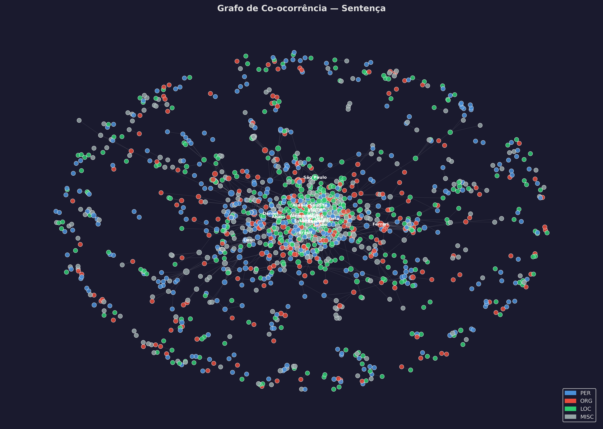
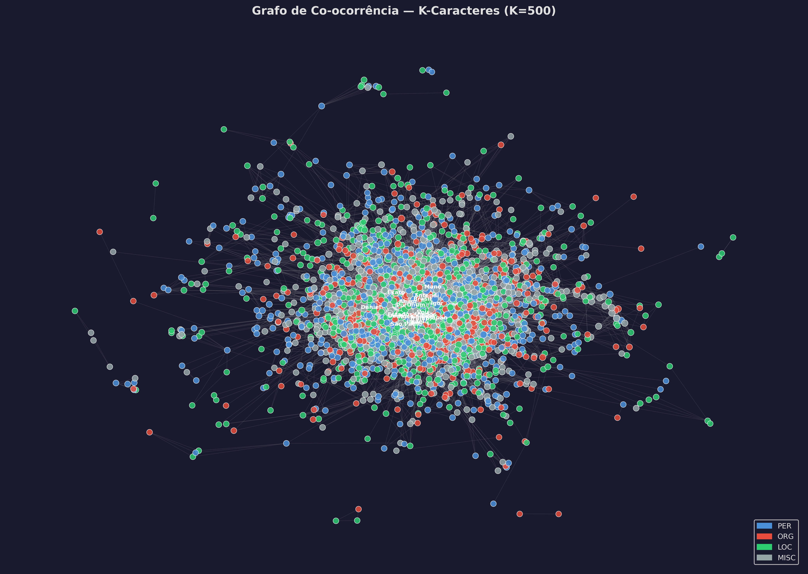
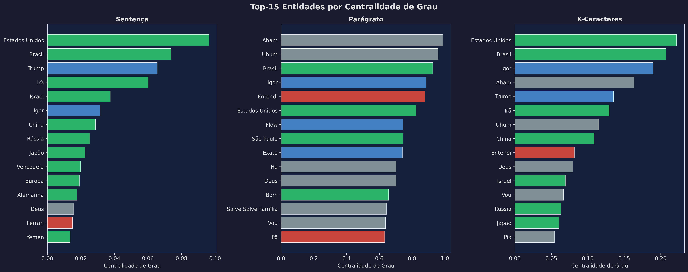
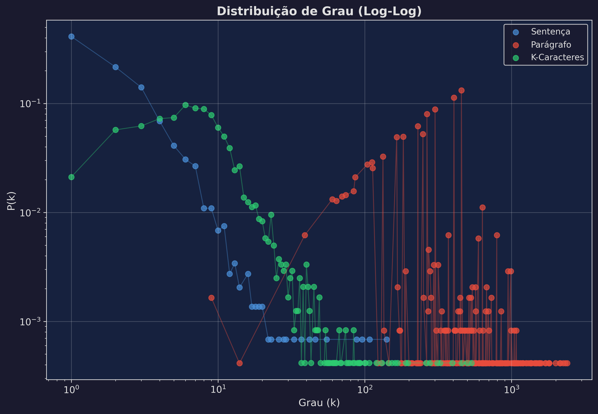
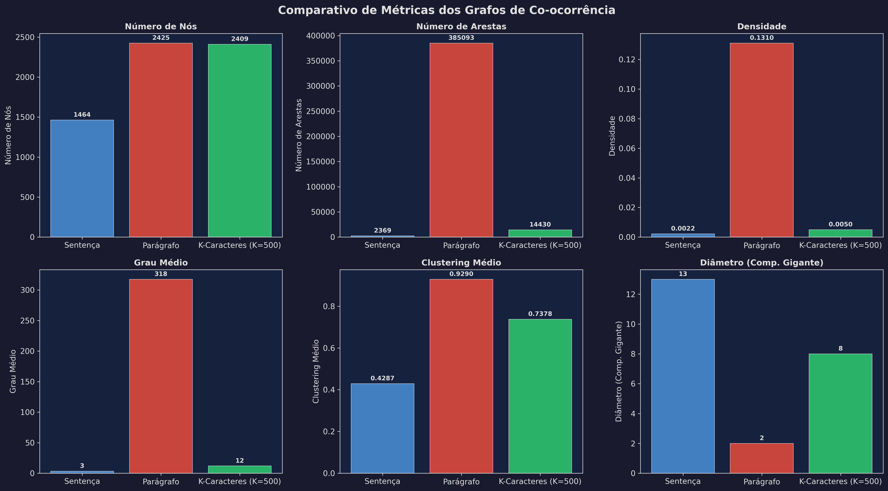

# Grafos de Co-ocorrência com NER — Transcrições de Podcasts YouTube

> Projeto desenvolvido como "Trabalho 01" da disciplina de Algoritmos e Estrutura de Dados II (DCA3702) da UFRN.

## 👤 Integrantes
- **José Alex Araújo de Santana** — Matrícula: 20220011457

---

## 📖 Descrição das Atividades

O objetivo deste projeto é construir grafos de co-ocorrência baseados em Entidades Nomeadas (NER) extraídas de transcrições de episódios do *Flow Podcast*. O pipeline foi dividido em quatro etapas principais, cada uma executada por um script dedicado.

### 1. Pipeline de Coleta de Dados (`1_coleta_dados.py`)
Utilizamos a biblioteca `youtube-transcript-api` para extrair as legendas diretamente dos vídeos selecionados no YouTube do canal *Flow Podcast*. Foram filtrados vídeos em Português-BR.
Como as legendas auto-geradas muitas vezes vêm fragmentadas e sem pontuação, implementamos uma heurística de reconstrução: baseamo-nos nas "pausas" (gaps de tempo) entre um trecho e outro para inferir o que seria um final de sentença (pausas curtas > 0.8s) e uma quebra de parágrafo (pausas longas > 2.0s). O resultado limpo e normalizado (NFC) foi salvo na pasta `data/processed`.

### 2. Extração de Entidades (NER) (`2_extrator_ner.py`)
Para o reconhecimento das entidades, utilizamos a biblioteca NLP **spaCy** com o modelo robusto para a língua portuguesa `pt_core_news_lg`. A escolha pelo spaCy em detrimento de uma API de LLM (Large Language Model) baseou-se em três fatores:
- **Determinismo:** O modelo entrega o mesmo resultado garantido toda vez que roda (sem variações aleatórias).
- **Offline e Gratuito:** Processamento local sem dependência de rate limits de API ou requisições de rede.
- **Velocidade:** Processa o grande volume de texto das entrevistas longas de forma muito mais eficiente.

As categorias filtradas foram: Pessoas (`PER`), Organizações (`ORG`), Localidades (`LOC`) e Miscelâneas (`MISC`). O texto das entidades passou por uma normalização (remoção de preposições, *title case*) para unificação de nós, registrando exatamente a linha (sentença e parágrafo) e a posição inicial no arquivo onde ocorreram.

### 3. Formação dos Grafos de Co-ocorrência (`3_gerador_grafos.py`)
Os grafos foram gerados utilizando a biblioteca `networkx` e salvos no formato GEXF/GraphML (`data/graphs/`). Para explorar o peso semântico das conexões, calculamos co-ocorrências (arestas) considerando três distâncias (janelas) distintas:

- **Distância 1: Sentença.** Duas as entidades co-ocorrem se ambas foram citadas na MESMA frase. Esta distância traz ligações de alta precisão (estavam num contexto super amarrado), mas resulta em um grafo consideravelmente mais **esparso**.
- **Distância 2: Parágrafo.** Considera toda a ideia discutida no bloco de texto. Ele é bem mais conexo que o de sentenças, ligando entidades pelo contexto temático próximo.
- **Distância 3: $K$-Caracteres ($K=500$).**  Uma janela deslizante que engloba 500 caracteres, atravessando pontuações. É uma granularidade que fica num ponto médio do sentido orgânico do texto e permitiu gerar uma modelagem maleável.

---

## 📊 Resultados e Imagens

Foram gerados scripts focados unicamente na renderização e comparação quantitativa das métricas topológicas resultantes de cada metodologia (`4_plot_resultados.py`).

### Grafos e Visualização de Topologia
*(Imagens extraídas em alta resolução. Nós: Pessoas em azul, Organizações em vermelho, Locais em verde, MISC em cinza. O diâmetro do nó é proporcional ao Grau).*

<div align="center">
  <h4>Grafo por Sentença</h4>
  
  <br><br>
  <h4>Grafo por Parágrafo</h4>
  
  <br><br>
  <h4>Grafo por K-Caracteres (K=500)</h4>
  
</div>

<br>

### Top Entidades e Distribuição
<div align="center">
  
  <br><br>
  
</div>

<br>

### Comparativo Analítico de Métricas

<div align="center">
  
</div>

| Métrica | Sentença | Parágrafo | K-Chars (500) |
| --- | --- | --- | --- |
| **Nós Totais** | *(vide imagem)* | *(vide imagem)* | *(vide imagem)* |
| **Arestas Totais** | Maior esparsividade | Conexões densas temáticas | Densidade intermediária |

---

## 🔍 Análise Crítica

### Sentença vs Parágrafo vs K-Caracteres
Como visto pelos resultados plotados em `comparativo_metricas.png`, a restrição gerada pela barreira da **sentença** faz com que entidades fiquem "ilhadas" mais facilmente (nota-se maior número de componentes independentes). Já na modelagem via **parágrafos**, o aumento substancial do Grau Médio indica que criar *clusters* discursivos (em que tudo no parágrafo se relaciona) aumenta substancialmente a conectividade do "componente gigante". A modelagem por $K=500$ cria uma alternativa controlável para evitar as perversidades de parágrafos gigantes que perdem semântica — mantendo a proximidade baseada única e exclusivamente no comprimento textual.

### Limitações
- Erros sistemáticos herdados das legendas auto-geradas do YouTube (o NLP, por mais forte e determinístico que seja, ainda engole entidades erroneamente grafadas ali e os une a parágrafos incorretos devido a falta de vírgulas perfeitas).
- A segmentação de entidades pode juntar menções erradas por falta rigorosa no "Entity Resolution" (ex: fundir as menções a pessoas diferentes se elas têm o mesmo pronome de tratamento vizinho). 

### Insights
Notou-se pelas plotagens da Distribuição de Grau ($log-log$) que ela segue visualmente uma tendência clara de rede "livre de escala" (*Scale-Free* ou Lei da Potência) **principalmente** nas vizinhanças maiores (parágrafo). Um conjunto seleto e agudo de entidades é mencionado recorrentemente guiando a retórica do episódio, em contraposição a esmagadora e volumosa 'cauda longa' das entidades citadas uma única vez incidentalmente ao decorrer das 2 a 3 horas ininterruptas de conversa.

---

## 🎥 Apresentação
> 🔗 [Link do Vídeo da Apresentação no Loom](#) *(Aguardando upload e submissão p/ o dia 15/04 p/ a respectiva Demo)*

---

## 🔧 Como Reproduzir

### 1. Instalação (Ambiente Python 3.10+)
Clone o repositório e baixe as bibliotecas e o modelo de processamento de texto:
```bash
pip install -r requirements.txt
python -m spacy download pt_core_news_lg
```

### 2. Execução do Pipeline (Ordem recomendada)
```bash
# 1. Coletar os dados da playlist declarada em config/videos.yaml
python execution/1_coleta_dados.py

# 2. O extrator gerará os JSONs de NER em data/ner_output
python execution/2_extrator_ner.py

# 3. Este script varre os JSONs e cospe as topologias dos 3 grafos.
python execution/3_gerador_grafos.py

# 4. Desenha localmente as imagens das topologias e gráficos de atributos.
python execution/4_plot_resultados.py
```

## 📚 Referências
- Documentação do YouTube Transcript API
- Documentação NER: spaCy NLP framework (`pt_core_news_lg`)
- Ivanovitchm/DataStructure classes & Datasets de grafos
